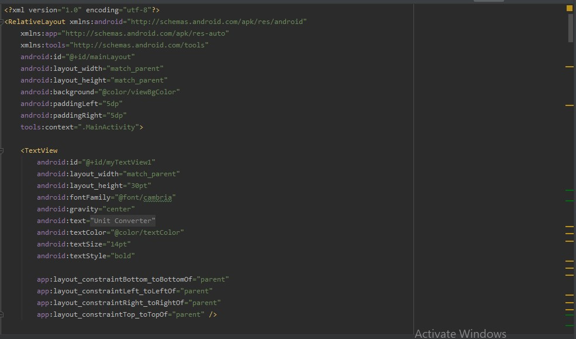

## Tugas Layout

 

1. Gambar Activity Main

2. Gambar Hasil Test 1

3. Gambar Hasil Test 2

4. Gambar Hasil Test 3

5. Gambar Hasil Test 4

6. Gambar Hasil Test 5.1

7. Gambar Hasil Test 5.2

8. Gambar Hasil Test 6

9. Gambar Hasil Test 7

10. Gambar Hasil Test 8.1

11. Gambar Hasil Test 8.2

12. Gambar Hasil Test 9

## Pernyataan Diri

Saya menyatakan isi tugas, kode program, dan laporan praktikum ini dibuat oleh saya sendiri. Saya tidak melakukan plagiasi, kecurangan, menyalin/menggandakan milik orang lain.

Jika saya melakukan plagiasi, kecurangan, atau melanggar hak kekayaan intelektual, saya siap untuk mendapat sanksi atau hukuman sesuai peraturan perundang-undangan yang berlaku.

Ttd,

***(Ferry Maulana)***