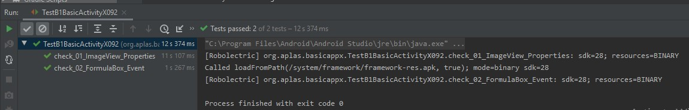

## Tugas Basic Activity

 

1. Gambar Hasil Test 1

1. Gambar Hasil Test 2

1. Gambar Hasil Test 3

1. Gambar Hasil Test 4

1. Gambar Hasil Test 5

1. Gambar Hasil Test 6.1

1. Gambar Hasil Test 6.2

1. Gambar Hasil Test 7

1.  Gambar Hasil Test 8

1.  Gambar Hasil Test 9

1.  Gambar Hasil Test 9

## Pernyataan Diri

Saya menyatakan isi tugas, kode program, dan laporan praktikum ini dibuat oleh saya sendiri. Saya tidak melakukan plagiasi, kecurangan, menyalin/menggandakan milik orang lain.

Jika saya melakukan plagiasi, kecurangan, atau melanggar hak kekayaan intelektual, saya siap untuk mendapat sanksi atau hukuman sesuai peraturan perundang-undangan yang berlaku.

Ttd,

***(Ferry Maulana)***